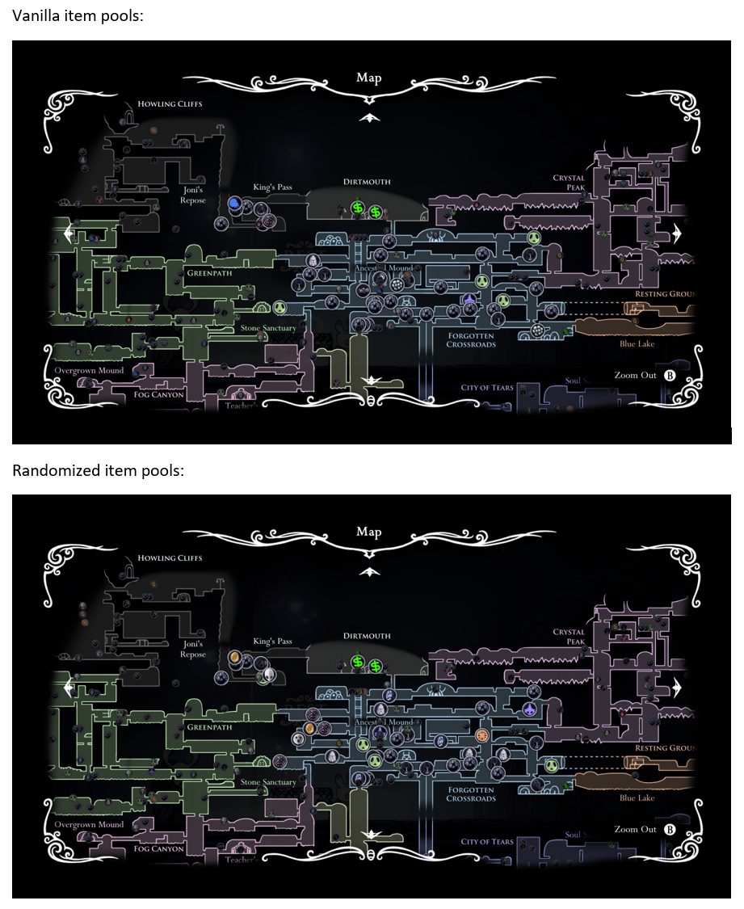

# Randomizer Map S

This is a fork of Rando Map Mod v0.5.1, with some different features.

This has been tested with both RandomizerMod v3.12(573) and v3.12c(884) (the Discord beta).

# Changelog
Version 1.0.3:
- Added new items in v3.12(884)

- Bugs that need to be fixed:
    - Shop Pin doesn't disappear when it is exhausted of items, but earlier instead
    - Some Pins might not be in the right place, or don't appear at all
    - The "reachable" Pins are based on the items found in the RandomizerHelperLog.txt. These don't include items that aren't randomized.

Version 1.0.2:
- Fixed the hovering map markers bug
- The state of the Pin groups and Rando/Unknown sprite settings are saved between game loads

Version 1.0.1:
- Correct Pins show up when a new game is loaded

Version 1.0.0:
- Use `CTRL-T` to toggle Pins between vanilla and randomizer item pools
- Use `CTRL-P` to toggle all Pins on/off
- Use `CTRL-R` to toggle all Pins to question marks
- Use `CTRL-1` ... `CTRL-6` to toggle Pin groups on/off
- Reachable logic applies to the shop Pins (kinda)
- Fixed some question mark Pins appearing by default

- Removed some stuff (based on my own preference/code clashes):
    - No Multiworld support for now (shold be easy to add later)
    - CTRL-M now gives you all Maps + Quill, but no Wayward Compass
    - Disabled other Pin styles
    - Disabled prereq markers (!)
