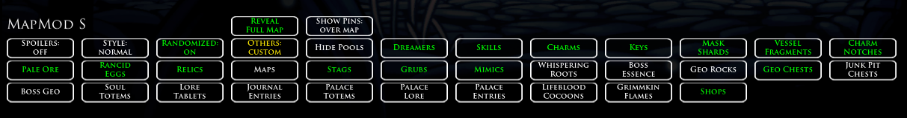

# Randomizer Map S
Randomizer Map S is a Hollow Knight mod used with Randomizer Mod. It gives the option to show the player where items are on the World Map, and optionally what they are.

This fork of CaptainDapper's original mod has been expanded on with more features, bug fixes and a Pause Menu UI. It is currently compatible with:
- Randomizer v3.13(888) - recommended
- Randomizer v3.12c(884)
- Randomizer v3.12(573)
- Randomizer ItemSync 1.3.0
- Randomizer Multiworld 0.1.1

https://github.com/homothetyhk/HollowKnight.RandomizerMod
https://github.com/Shadudev/HollowKnight.MultiWorld

# Quick Start Guide
- Use `CTRL-M` during a game to enable the mod and give an empty Map.
- If you want the complete Map with all the Pins, then click "Reveal Full Map" in the Pause Menu.

# Full Features
- Along with `CTRL-M`, you can also talk to Elderbug a few times to enable the mod.

- The World Map will now show Pins for every item check.
    - Big Pins means the items are reachable according to RandomizerMod's logic
    - Small Pins means the items are not randomized or not reachable
    - Pins for randomized items will disappear as you check them
    - Randomizer Map's settings are displayed at the bottom

- The Pause Menu UI has the following buttons, with the following hotkeys:
    - "Reveal Full Map": Gives you every Map item and fills in every room on the Map. Cannot be undone
    - "Show Pins": Toggle Pins to show everywhere on the Map, or only for Map items you have picked up

    - "Spoilers" `CTRL-1`: Toggle Pins between vanilla (non-spoiler) and spoiler item pools
    - "Style" `CTRL-2`: Toggle the style of the Pins
    - "Randomized" `Ctrl-3`: Toggle all Pins for randomized items on/off
    - "Others" `Ctrl-4`: Toggle all Pins for other items on/off (excluding Shops)

    - "Show/Hide Pools": Open/close a panel with a toggle for each spoiler item pool

The Pin settings are saved between game loads.

# How To Install
1. Make sure you have RandomizerMod v3.13(888) (or the older working builds) properly installed.
2. Download the latest release of `RandoMapMod.zip`.
3. Unzip and copy RandoMapMod.dll to the folder `...\Steam\steamapps\common\Hollow Knight\hollow_knight_Data\Managed\Mods`.
4. That's it!

# Acknowledgements
- The Hollow Knight/Hollow Knight Speedrun Discord Channels for always giving very sound advice and suggestions
- CaptainDapper for making the original mod
- Chaktis for helping with sprite art

# Version 1.1.1 Changes
- Added the option to reveal the full Map or leave as is (if you want Map items to be useful) in the Pause Menu
- Also added an option to show Pins in all areas or only Pins for unlocked Maps
- Fixed Hallownest Crown items not showing up in Quick Map
- Fixed Elevator Pass Pin not showing up
- Removed Jiji Pin
- More code cleanup

# Known Bugs / Missing Features
- Not compatible when RandomizerMod isn't installed
- Non-randomized items don't get checked off on the Map
- Reachable items don't show properly with room rando
